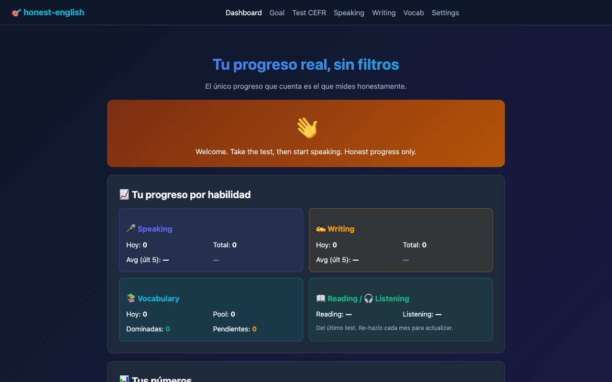

# honest-english

> **Language apps reward you for opening them. This one measures whether you can
> actually speak English — and tells you, out loud, when you can't.**

I am a Spanish speaker learning English to get hired. Every app I tried gave me a
streak and a green checkmark while my speaking stayed exactly where it was. So I
built the tracker I actually needed: it makes you talk into the microphone, scores
what came out word by word, and shows the gap between what you *understand* and
what you can *produce* — the trap every self-taught learner falls into.

### ▶ Try it: **<https://gibson1987r.github.io/honest-english/>**

No sign-up, no install, no backend. Take the CEFR test and speak into your mic —
it works in the browser as-is. The AI features are optional and use *your* key.

[](https://gibson1987r.github.io/honest-english/)

[](https://developer.mozilla.org/en-US/docs/Web/JavaScript)
[](https://gibson1987r.github.io/honest-english/)
[](LICENSE)
[](#getting-started)

---

## Why this exists

Most language apps gamify the wrong thing. They reward streaks of *opening the
app* instead of streaks of *actually speaking the language*. This project does
the opposite:

- It measures **real production** (you must speak out loud, daily).
- It tracks the gap between **comprehension and production** — the classic trap
  of the self-taught learner.
- It tells you the truth: *"You haven't practiced speaking in 7 days. The muscle
  is atrophying."*

This is also a portfolio project. The codebase is intentionally vanilla — no
React, no build step, no dependencies. Every line is yours to read.

---
## Features

### 📝 CEFR Test (Phase 1)
30+ questions calibrated A1 → C2 across grammar, vocabulary, reading, and
listening. Maps you to a real international level. Self-assessment for speaking
and writing because they cannot be auto-measured.

### 🎤 Speaking Module (Phase 1 + 2 — the killer feature)
- **Web Speech API mode** (works offline, free): records your voice, transcribes
  it, compares word-by-word with the expected sentence. You get a 0-100 score.
- **Whisper mode** (BYOK OpenAI, more accurate): same flow but uses OpenAI's
  Whisper for much better transcription accuracy.
- Green/yellow/red highlighting shows which words you nailed, which you missed,
  which you said extra.

### ✨ Dynamic Test Generation (Phase 3)
With your Anthropic API key, Claude generates fresh CEFR-calibrated questions at
your exact level. No more repeating the same test.

### ✍️ Writing Practice with AI Feedback (Phase 4)
Writing prompts at your level. You write, submit, and Claude gives you:
- An honest score
- Specific strengths
- Concrete corrections (original / corrected / why)
- One next step to focus on

No empty praise.

### 🗺 Dynamic Roadmap
Your improvement plan depends on:
- Your detected CEFR level
- The gap between your comprehension and your production
- Whether you've actually been practicing (not just opening the app)

### 📚 Curated Resources, Auto-Filtered
A real list (iTalki, Tandem, BBC, Anki, YouGlish, etc.) filtered automatically
to your level and ordered by what's actually most useful for you.

### 🔥 Brutal-Honesty Dashboard
Streak counter, days since last practice, warnings when you slip. The dashboard
doesn't celebrate intent; it celebrates evidence.

---

## Tech Stack

| Layer | Choice | Why |
|-------|--------|-----|
| Frontend | Vanilla HTML/CSS/JS | No build step, no dependencies, easy to deploy and maintain |
| Persistence | `localStorage` | Privacy-first: nothing leaves your browser |
| Speech-to-text | Web Speech API + OpenAI Whisper | Free baseline, optional upgrade |
| Text-to-speech | Web Speech API (`SpeechSynthesis`) | Native, no API costs |
| AI features | Anthropic Claude API (BYOK) | Quality > all, with optional Whisper for audio |
| Hosting | GitHub Pages | Free, static, perfect fit |
| CI/CD | GitHub Actions (`pages.yml`) | Auto-deploy on push to main |

---

## The decision worth telling: BYOK instead of a backend

The obvious way to add AI features is a small server that holds my API key and
proxies the calls. I decided against it, and that decision shaped the whole
project.

**The problem with the server:** the moment my key sits behind a public endpoint,
every stranger's Whisper transcription is billed to me. Protecting it means auth,
rate limiting, a database of users, a host that never sleeps — a weekend of work
and a monthly bill, so that a portfolio project nobody is paying for can be
abused for free.

**What I did instead — BYOK (bring your own key):** the key is typed into
`settings.html`, stored in the visitor's own `localStorage`, and sent from their
browser straight to OpenAI or Anthropic. It never touches a machine of mine,
because I don't have one in the path.

**What it bought:**

- **Zero infrastructure.** The whole app is static files on GitHub Pages. Nothing
  to deploy, nothing to pay for, nothing to keep alive at 3 a.m.
- **A privacy claim I can actually defend.** Recordings and progress never leave
  the browser. That is not a promise about my server — there is no server.
- **Costs stay honest.** The user sees the real price of what they use
  (~$0.006/min of Whisper) instead of hitting my invisible quota.

**What it cost, and I'll say it plainly:** the barrier to entry is real — a
visitor who doesn't have an API key can't use Phases 2–4. That's why every base
feature (the CEFR test, Web Speech pronunciation scoring, the dashboard) works
with no key at all: the app has to be useful to someone who just clicked the
link. The trade was deliberate, not an accident of scope.

---

## Project Structure

```
honest-english/
├── index.html          Dashboard with streak + honest messaging
├── test.html           CEFR test (curated or AI-generated)
├── speaking.html       Speaking + pronunciation (Web Speech or Whisper)
├── writing.html        Writing prompts + Claude feedback
├── settings.html       BYOK API key management
├── styles.css          Shared design system
│
├── js/
│   ├── tracker.js              localStorage + honest stats
│   ├── api.js                  Shared OpenAI + Anthropic helpers
│   ├── test.js                 Test runner
│   ├── speaking.js             Web Speech + Whisper integration
│   ├── writing.js              Writing module + Claude feedback
│   ├── dynamic-questions.js    Claude question generation
│   ├── results.js              CEFR scoring + roadmap generation
│   └── resources.js            Resource filtering + rendering
│
├── data/
│   ├── questions.json          Curated CEFR questions
│   ├── prompts.json            Speaking practice phrases by level
│   ├── writing-prompts.json    Writing prompts by level
│   └── resources.json          Curated learning resources with CEFR tags
│
├── .github/
│   ├── workflows/pages.yml     Auto-deploy to GitHub Pages
│   ├── ISSUE_TEMPLATE/
│   └── pull_request_template.md
│
├── README.md
├── CHANGELOG.md
├── LICENSE
└── .editorconfig
```

---

## Getting Started

### Run locally

`SpeechRecognition` requires HTTPS or localhost. Don't open the HTML files
directly with `file://` — it won't work. Use a tiny static server:

```bash
git clone git@github.com:Gibson1987R/honest-english.git
cd honest-english
python3 -m http.server 8080
# open http://localhost:8080
```

### Enable AI features (optional)

The base features work without any API key. To unlock Phase 2/3/4:

1. Get an [OpenAI key](https://platform.openai.com/api-keys) (for Whisper)
2. Get an [Anthropic key](https://console.anthropic.com/) (for Claude)
3. Open `settings.html` and paste them. They are stored only in your browser.

**Cost honesty:** Whisper is ~$0.006 per minute of audio. A Claude
question-generation call is fractions of a cent. A writing feedback call is
~$0.01. You can use this entire app for a month for less than $1.

---

## Browser Support

| Browser | Test | Speaking (Web Speech) | Speaking (Whisper) | Writing |
|---------|------|----------------------|--------------------|---------|
| Chrome / Edge | ✅ | ✅ | ✅ | ✅ |
| Safari (macOS) | ✅ | ✅ | ✅ | ✅ |
| Firefox | ✅ | ❌ (no Web Speech) | ✅ | ✅ |

Recommended: **Chrome** for the most reliable speech recognition.

---

## Roadmap

- [x] Phase 1: CEFR test + Web Speech speaking + dashboard
- [x] Phase 2: Whisper integration for accurate pronunciation
- [x] Phase 3: Dynamic question generation with Claude
- [x] Phase 4: Writing practice with Claude feedback
- [ ] Phase 5: Listening practice with curated YouTube clips and transcripts
- [ ] Phase 6: Spaced repetition for vocab seen in real practice
- [ ] Phase 7: Weekly digest email with honest progress summary
- [ ] Phase 8: Pronunciation phoneme analysis with Whisper word timestamps

See the [GitHub Issues](../../issues) for individual tasks.

---

## Honest Disclaimers

- The CEFR score is an **approximation**, not an official certification. Real
  exams test more dimensions.
- Speech recognition (both Web Speech and Whisper) measures **intelligibility**,
  not native accent perfection.
- This tool is useless if you don't actually practice. It tracks you; it doesn't
  do the work for you.
- BYOK means **you** are responsible for your API keys. They're stored locally
  in your browser; don't use this on a shared computer.

---

## Contributing

Fork it. Build your own. PRs welcome, but read the honest checklist in the PR
template: no gamification, no dependencies, no features that don't serve real
learning.

---

## License

MIT — see [LICENSE](LICENSE).

Built by [Gibson Rosales](https://github.com/Gibson1987R), learning English
in public, refusing to lie about progress.
